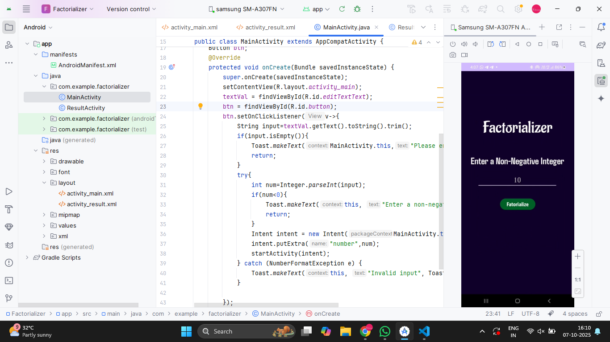
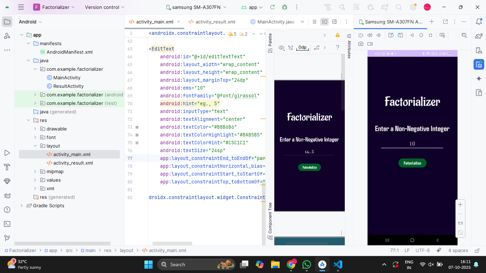
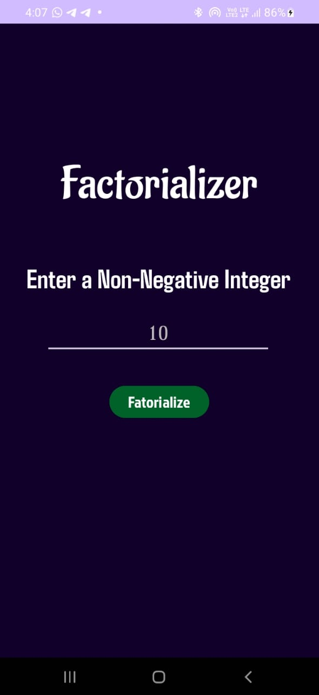

# Ex.No:2b To create a two screens , first screen will take one number input from user. After click on Factorial button, second screen will open and it should display factorial of the same number using Explicit Intents.


## AIM:

To create a two screens , first screen will take one number input from user. After click on Factorial button, second screen will open and it should display factorial of the same number using Explicit Intents.


## EQUIPMENTS REQUIRED:

Latest Version Android Studio

## ALGORITHM:
1. Start the application with MainActivity as the launcher activity.

2. Display a button in MainActivity to navigate forward.

3. On button click, create an explicit intent from MainActivity to MainActivity2.

4. Start MainActivity2 using the created explicit intent.

5. Display a button in MainActivity2 to navigate forward.

6. On button click, create and start an explicit intent from MainActivity2 to MainActivity3.

7. Register all three activities in the Android Manifest file.


## PROGRAM:
* Developed by : VISHWARAJ G
* Registeration Number : 212223220125
#### 1. MainActivity.java
```
package com.example.factorializer;

import android.content.Intent;
import android.os.Bundle;
import android.widget.Button;
import android.widget.EditText;
import android.widget.Toast;

import androidx.activity.EdgeToEdge;
import androidx.appcompat.app.AppCompatActivity;
import androidx.core.graphics.Insets;
import androidx.core.view.ViewCompat;
import androidx.core.view.WindowInsetsCompat;

public class MainActivity extends AppCompatActivity {
    EditText textVal;
    Button btn;
    @Override
    protected void onCreate(Bundle savedInstanceState) {
        super.onCreate(savedInstanceState);
        setContentView(R.layout.activity_main);
        textVal = findViewById(R.id.editTextText);
        btn = findViewById(R.id.button);
        btn.setOnClickListener(v->{
            String input=textVal.getText().toString().trim();
            if(input.isEmpty()){
                Toast.makeText(MainActivity.this,"Please enter a number",Toast.LENGTH_SHORT).show();
                return;
            }
            try{
                int num=Integer.parseInt(input);
                if(num<0){
                    Toast.makeText(this, "Enter a non-negative number", Toast.LENGTH_SHORT).show();
                    return;
                }
                Intent intent = new Intent(MainActivity.this,ResultActivity.class);
                intent.putExtra("number",num);
                startActivity(intent);
            } catch (NumberFormatException e) {
                Toast.makeText(this, "Invalid input", Toast.LENGTH_SHORT).show();
            }

        });
    }
}
```
#### 2. ResultActivity.java
```
package com.example.factorializer;

import android.os.Bundle;
import android.widget.TextView;

import androidx.activity.EdgeToEdge;
import androidx.appcompat.app.AppCompatActivity;
import androidx.core.graphics.Insets;
import androidx.core.view.ViewCompat;
import androidx.core.view.WindowInsetsCompat;

import java.math.BigInteger;

public class ResultActivity extends AppCompatActivity {
    TextView resText;
    @Override
    protected void onCreate(Bundle savedInstanceState) {
        super.onCreate(savedInstanceState);
        setContentView(R.layout.activity_result);
        resText = findViewById(R.id.textView4);
        int number = getIntent().getIntExtra("number",0);
        BigInteger fact = factorial(number);
        resText.setText(number+"! = "+fact.toString());
    }
    private BigInteger factorial(int n) {
        BigInteger result = BigInteger.ONE;
        for (int i = 2; i <= n; i++) {
            result = result.multiply(BigInteger.valueOf(i));
        }
        return result;
    }
}
```

## OUTPUT

#### Coding Part


#### Design_Part


#### Task1


#### Task2


## RESULT
Thus a Simple Android Application create a Explicit Intents using Android Studio is developed and executed successfully.


